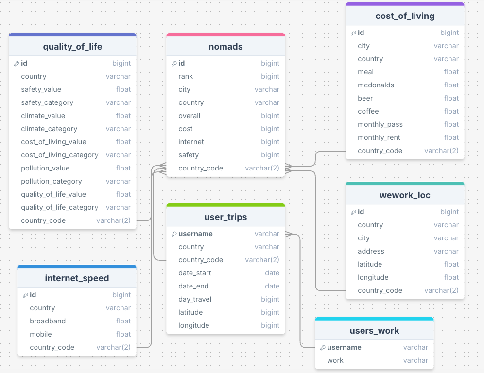
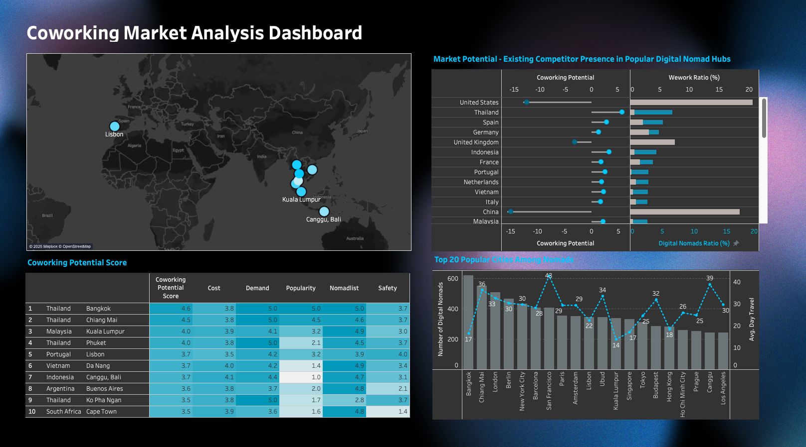

# 🌍 Digital Nomads & The Market Potential for Coworking Spaces

This project explores the rise of digital nomadism and identifies high-potential cities for coworking space investment. Using data-driven analysis and interactive dashboards, we uncover where demand is growing — and how businesses can meet it.

---

## 👤 Who Are Digital Nomads?

Digital nomads are remote workers who live and work while traveling across different cities and countries. They rely on stable internet, flexible workspaces, and affordable living to sustain their mobile lifestyle.

---

## 📈 Background / Trend

- In 2024, there were over **40 million digital nomads** globally.
- The U.S. alone accounted for **18.1 million nomads**.
- Digital nomads contribute over **$787 billion USD/year** to the global economy.
- Remote work, affordable travel, and flexible careers continue to fuel this trend.

---

## **Business Questions**

### **Market Identification & City Selection**
- Where should we establish co-working spaces to attract digital nomads?
- Which countries or cities are most attractive for digital nomads?
- How do quality of life factors (e.g., safety, cost of living, healthcare, climate, internet speed) influence city selection?

### **Competitive Analysis**
- Which cities have low competition but high demand for co-working spaces?
- What are the gaps in existing co-working spaces that we can fill? (WeWork)

### **Digital Nomads Behavior Analysis**
- How long do digital nomads stay in one country on average?
- What are the most common work types among digital nomads?

### **Hypothesis**
1. Digital nomads prefer cities with **lower cost of living**.
2. **Quality of life** has **less impact** on city selection than affordability.

---

## **Data Sources**
- [Global Cost of Living Dataset](https://www.kaggle.com/datasets/mvieira101/global-cost-of-living): Contains the cost of living indices for various cities, including food, transportation, and rent.
- [Quality of Life by Country](https://www.kaggle.com/datasets/ahmedmohamed2003/quality-of-life-for-each-country): Measures safety, healthcare, climate, and purchasing power.
- [Global Internet Speed 2022](https://www.kaggle.com/datasets/prashant808/global-internet-speed-2022): Lists broadband and mobile internet speeds by country.
- **Web Scrapers**:
  - [NomadList](https://nomads.com/): Extracts city ratings and digital nomad statistics.
  - [WeWork Sitemap](https://www.wework.com/sitemap): Retrieves global WeWork locations.

---

## **Data Cleaning**

### **Cost of Living Data**
- Selected relevant columns (`meal`, `mcdonalds`, `beer`, `coffee`, `monthly_pass`, `monthly_rent`).
- Renamed columns for clarity.
- Converted values from **USD to EUR** using a conversion rate of `0.953124`.

### **Quality of Life Data**
- Standardized column names (lowercase, underscores instead of spaces).
- Removed irrelevant columns (`purchasing_power`, `health_care`, `property_price_to_income`, etc.).

### **Internet Speed Data**
- Loaded broadband and mobile speed data.

### **Nomads & Users Work Data**
- Removed unnecessary columns (`followers`, `following`, `education_raw`).
- Handled missing values and renamed `work_raw` to `work`.
- Transformed `work` column into **binary matrix format** for occupation analysis.

### **User Trips Data**
- Dropped redundant columns (`country_slug`, `place_slug`).
- Converted `date_start` and `date_end` into datetime format.
- Calculated **travel duration (`day_travel`)** for each user trip.
- Normalized `city` and `country` names to remove special characters.

### **WeWork Locations Data**
- Cleaned **address formatting** to fix encoding issues.
- Applied **geolocation functions** to add latitude/longitude for missing locations.
- Standardized country names and **converted incorrect country codes (e.g., `UK` → `GB`)**.

---

## **Database Design & Creation**
- **ERD**

The `nomads` schema consists of the following tables in MySQL:

- **`nomads`**: Contains digital nomad user data.
- **`quality_of_life`**: Quality of life metrics per country.
- **`cost_of_living`**: Breakdown of living costs in various cities.
- **`internet_speed`**: Internet speed data by country.
- **`wework_loc`**: Locations of WeWork offices worldwide.
- **`user_trips`**: Records of digital nomads' stays in different countries.
- **`users_work`**: Information on digital nomads' professions and work trends.

---

## **Data Analysis**

## 👥 Nomads Profile

- **Average age:** 32 years  
- **Top occupations:**  
  - 20% Software & Web Developers  
  - 19% Startup Founders  
  - 5% UX/UI Designers  
- **Income:** Median €78,200, Average up to €114,000  
- **Preferred workspace:**  
  - 60% Home  
  - 15% Coworking  
  - 8% Cafés

---

## 📍 Most Popular Cities & Travel Duration

- Top cities: **Bangkok**, **Chiang Mai**, **Kuala Lumpur**
- Typical stay: **2–4 weeks per city**

---

## 🔥 Factors That Drive Nomads' City Preference

### Correlation Heatmap Insights:
- **Cost of Living Value (+0.47)**
- Cities with a higher cost of living tend to rank lower in preference (nomads prefer affordable cities).
- **Safety Value (+0.41)**
- Safer cities tend to be slightly less preferred. This suggests that nomads might prioritize other factors (e.g., affordability, internet speed) over extreme safety.
- **Quality of Life Value (+0.39)**
- Higher quality of life correlates slightly with a worse rank, indicating nomads may not prioritize high-quality life cities if they are expensive.
- **Internet Speed (+0.22)**
- Better internet speed slightly correlates with worse ranking, suggesting that other factors like cost are more important.However, the correlation is weak, meaning internet speed does play a role, but not as much as affordability.
- **Interpretation:**
-Affordability remains the biggest concern—nomads prefer cheaper cities. Safety, quality of life, and internet speed are important but do not strongly determine ranking. Nomads may tolerate moderate internet speed if the cost of living is low.

---

## 📈 Market Opportunities

- Southeast Asia = Nomad hotspot  
- Affordable, digital-ready cities attract high nomad volume  
- Underserved coworking infrastructure presents investment potential

---

## 🏢 Market Leaders & Gaps

- **WeWork** is dominant in the US and Western Europe  
- Underserved regions: Thailand, Vietnam, Indonesia, Malaysia
- **Gaps exist** where nomads are present but branded coworking isn’t

---

## 🌍 High-Potential Countries / Cities

| Country        | City                |
|----------------|---------------------|
| Thailand       | Bangkok, Chiang Mai |
| Indonesia      | Ubud, Jakarta       |
| Vietnam        | Ho Chi Minh City    |

---

## 🧮 KPI Definition — *Coworking Potential Score*

A composite score calculated from normalized (1–5) inputs:

coworking_potential_score = (
    cost_of_living_score * 0.3 +
    coworking_demand_score * 0.3 +
    nomad_web_score * 0.2 +
    popularity_score * 0.2
)

---

## 🧪 Hypothesis Testing

### 1️⃣ Cost of Living
- **T-Statistic:** 15.83  
- **P-Value:** 0.0189 ✅  
- **Result:** Statistically significant  
- **Insight:** Nomads prefer low-cost cities

### 2️⃣ Quality of Life
- **T-Statistic:** -0.7078  
- **P-Value:** 0.6025 ❌  
- **Result:** Not statistically significant  
- **Insight:** Quality of life is not a strong predictor of nomad city preference

---

## 📊 Tableau Dashboard

**Interactive dashboard built with Tableau**

**Features:**
- Compare nomad metrics and coworking scores
- Visualize global coworking opportunity cities
- Tooltip on map for features scoring
- Tooltip on city table for cost of living

---

## 📌 Conclusion & Insights

### 🧠 Key Takeaways:
- Southeast Asia is the leading digital nomad hub  
- Cost of living is a stronger driver than quality of life  
- Nomads are mainly tech workers and startup founders  
- Typical stay is **2–4 weeks** — they need **short-term, flexible workspaces**

---

### 💼 Business Insight:
> **Build flexible, tech-ready coworking spaces in affordable, high-demand cities.**  
> Focus on short-term passes, plug-and-play setup, and community-driven design.

---

## 📅 Project Management (Jira)

Tasks were managed using a Jira board
(https://rebeccaaawoo.atlassian.net/jira/software/projects/DAP/boards/1?atlOrigin=eyJpIjoiMDE2YWFiNDIyNTFmNDZkZTgzMTM1OTRjNmU0NjQyMmEiLCJwIjoiaiJ9)

---

## Presentation (Canva)
(https://www.canva.com/design/DAGhaH3yF4E/RsY9lXTLT7EKUzRusN7ocw/edit?utm_content=DAGhaH3yF4E&utm_campaign=designshare&utm_medium=link2&utm_source=sharebutton)

---

## 🚧 Obstacle & Learning

### 🔧 Challenge:
One of the main challenges during this project was handling **inconsistent data formats and missing values** across multiple sources. Since the datasets were scraped or sourced from different platforms (e.g. Nomadlist, Numbeo, Speedtest, WeWork), they had varying structures, column names, units, and even naming conventions for cities and countries.

Some examples of issues encountered:
- Different spellings or formats for city names (e.g., "Ho Chi Minh" vs. "Ho Chi Minh City")
- Missing values for certain indicators (e.g., internet speed, cost index)
- Scoring systems with different ranges and scales (1–100 vs 0–5)
- Outliers that skewed analysis (e.g., extremely high cost values)

All of this made data cleaning and unification a **critical bottleneck** in the early stages.

---

### 📚 Learnings:

- **🔄 Prototype cleaning logic early:**  
  Before fully collecting and enriching the dataset, I built a cleaning pipeline prototype to test the feasibility of normalization, scoring, and joining multiple sources. This saved time and helped me catch format conflicts early on.

- **🔍 Validate assumptions through quick EDA:**  
  I learned to never assume the data is analysis-ready — running basic statistical summaries and correlation matrices early helped me identify which columns were trustworthy, which ones needed transformation, and which could be dropped.

- **🎯 Define KPIs clearly before dashboarding:**  
  I realized that it’s much more efficient to define **what you're trying to measure** (e.g., coworking potential score) before diving into Tableau. This ensured I collected the right variables and avoided scope creep.

- **🧠 Keep logic transparent for reproducibility:**  
  I documented every transformation (e.g., min-max normalization, scoring ranges) so that the methodology could be reviewed or reproduced later if needed — an important habit when dealing with scraped or composite data.

- **Simplicity is powerful**  
  I learned to **reduce clutter** and embrace **minimalism**. One strong insight per slide, supported by a clear visual — no dense paragraphs, no overloaded charts.
---

> Overall, this project sharpened my ability to **think ahead**, clean **messy, real-world data**, and translate that into meaningful, actionable insight.
